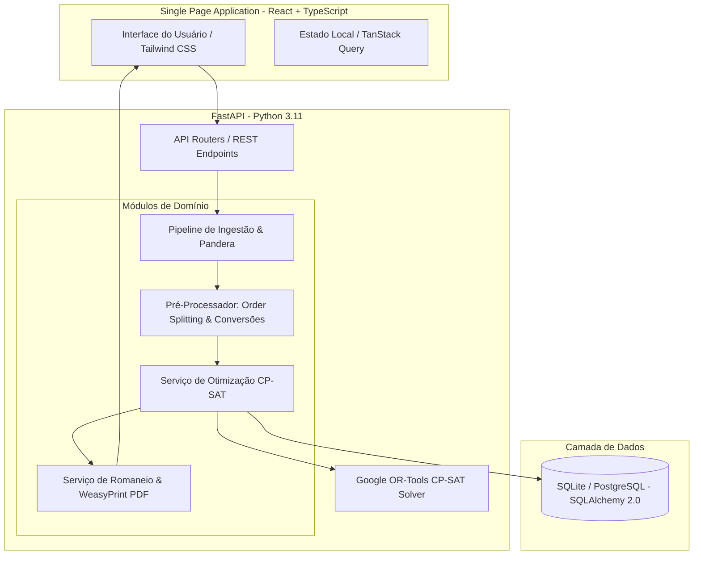

# 04. Arquitetura e Stack Tecnológica

## 1. Visão Arquitetural (C4 Model - Nível de Contêineres)

O **NobreLOG IA** adota o padrão arquitetural de **Monólito Modular** (*Modular Monolith*), combinando alto desacoplamento interno entre domínios e simplicidade operacional de implantação para o ambiente do Hackathon e produção inicial.



---

## 2. Stack Tecnológica Justificada

| Camada | Tecnologia Escolhida | Justificativa de Engenharia |
| :--- | :--- | :--- |
| **Backend Framework** | **FastAPI (Python 3.11+)** | Alta performance assíncrona, tipagem estática nativa, OpenAPI/Swagger automático e integração direta com o Google OR-Tools. |
| **Motor de Otimização**| **Google OR-Tools (CP-SAT)**| Solver líder mundial em programação por restrições combinatórias, suporte nativo a múltiplos recursos (peso + volume), restrições lineares e time budget estrito. Gratuito e Open Source (Apache 2.0). |
| **Validação de Dados** | **Pandera + Pydantic v2** | Validação declarativa em nível de DataFrame na ingestão (Pandera) e validação estrita em runtime na borda da API (Pydantic). |
| **Persistência / ORM**  | **SQLAlchemy 2.0 + SQLite/Postgres** | ORM moderno com suporte a migrações via Alembic. SQLite para execução autônoma no hackathon e PostgreSQL para produção. |
| **Geração de Documentos**| **WeasyPrint** | Renderização de PDFs de alta fidelidade visual a partir de HTML5 e CSS3 padronizados. |
| **Frontend Framework** | **React 18 + TypeScript (TSX)**| Tipagem forte, ecossistema rico e modularidade de componentes. |
| **Estilização / UI**   | **Tailwind CSS + Lucide Icons**| Design system limpo, responsivo e de rápido desenvolvimento de telas gerenciais. |
| **State Management**   | **TanStack Query (React Query)**| Gerenciamento eficiente de cache de requisições, mutações e estados de loading do solver. |

---

## 3. Organização de Diretórios do Projeto

```text
nobre-log-ia/
├── backend/
│   ├── app/
│   │   ├── api/                  # Endpoints REST (v1)
│   │   │   ├── routes_loads.py   # Otimização e aprovação de cargas
│   │   │   ├── routes_orders.py  # Gestão e visualização de pedidos
│   │   │   └── routes_vehicles.py# Cadastro de frota
│   │   ├── core/                 # Configurações globais, segurança e logs
│   │   ├── domain/               # Entidades e interfaces de negócio
│   │   ├── models/               # Modelos SQLAlchemy
│   │   ├── schemas/              # Schemas Pydantic e contratos Pandera
│   │   ├── services/             # Lógica de negócio pura
│   │   │   ├── cubagem_service.py    # Conversões e cálculo físico
│   │   │   ├── pre_processor.py      # Order Splitting e sanitização
│   │   │   ├── optimizer_cpsat.py    # Motor CP-SAT OR-Tools
│   │   │   └── pdf_service.py        # Geração do romaneio
│   │   └── main.py               # Ponto de entrada FastAPI
│   ├── tests/                    # Testes unitários e de integração
│   └── requirements.txt
├── frontend/
│   ├── src/
│   │   ├── components/           # Componentes visuais (KPIs, tabelas, modais)
│   │   ├── pages/                # Telas da aplicação
│   │   │   ├── Dashboard.tsx     # Visão executiva
│   │   │   ├── Preparation.tsx   # Seleção de eixo e veículo
│   │   │   ├── Optimizer.tsx     # Execução do solver e progresso
│   │   │   ├── ResultView.tsx    # Visualização da carga gerada
│   │   │   └── ManifestPDF.tsx   # Visualização do Romaneio
│   │   └── services/             # Clientes HTTP (Axios)
│   ├── package.json
│   └── tailwind.config.js
├── docs/                         # Documentação técnica completa
└── docker-compose.yml            # Orquestração de contêineres
```
