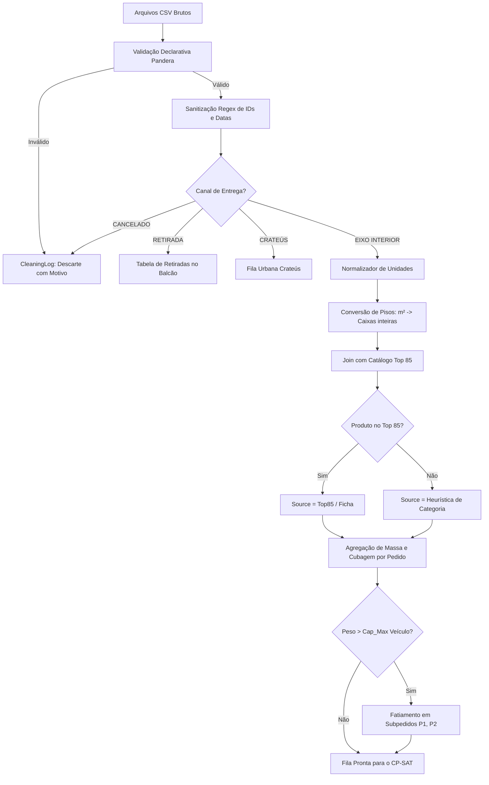

# 05. Engenharia de Dados, Limpeza e Cubagem

---

## 1. O Pipeline de Dados de Ponta a Ponta



---

## 2. Validação Declarativa com Pandera

Ao invés de validações condicionais dispersas, a entrada é submetida a um contrato rígido via `pandera`:

```python
import pandera.pandas as pa
from pandera.typing import Series

class PedidoRawSchema(pa.DataFrameModel):
    Pedido: Series[str] = pa.Field(nullable=False)
    Data: Series[str] = pa.Field(nullable=False)
    Vendedor: Series[str] = pa.Field(nullable=True)
    Situacao: Series[str] = pa.Field(isin=["Faturado", "Pendente", "Cancelado"], nullable=False)
    Cidade: Series[str] = pa.Field(nullable=False)
    Logistica: Series[str] = pa.Field(nullable=False)
    Situacao_CSV_Entrega: Series[str] = pa.Field(nullable=False)
    Valor_Pedido: Series[str] = pa.Field(nullable=True)
    Qtd_Itens: Series[int] = pa.Field(ge=1)
    Itens_Resumo: Series[str] = pa.Field(nullable=False)

    class Config:
        coerce = True
        strict = "filter"
```

---

## 3. Sanitização por Expressões Regulares (Regex)

Para resolver ruídos encontrados na base histórica da Nobre Lar:
1. **Identificadores de Pedido Corrompidos:**
   ```python
   def sanitize_order_id(raw_id: str) -> str:
       # Remove 'L', pontos, espaços e caracteres não numéricos
       clean_digits = re.sub(r'[^0-9]', '', str(raw_id))
       return f"L{clean_digits}" if clean_digits else "INVALIDO"
   ```
2. **Correção de Datas Tipadas com Erro:**
   - `26/08/14` \(\to\) `26/08/26` (ano incorreto 2014 em lote de 2026).
   - `15/0826` ou `20/0826` \(\to\) `15/08/2026` (falha na barra divisória).
   - `28/0/26` \(\to\) `28/08/2026` (mês incompleto).

---

## 4. Normalização Física e Tabela de Fallback

### 4.1 Pisos e Porcelanatos
A quantidade faturada em \(m^2\) é convertida em caixas industriais completas:
```python
import math

def compute_tile_boxes(qtd_m2: float, m2_per_box: float) -> int:
    return math.ceil(qtd_m2 / m2_per_box)
```

### 4.2 Tabela de Fallback de Cubagem por Categoria (Para os 587 SKUs fora do Top 85)
Quando o código do produto não consta no Top 85, o sistema aplica a média da sua classe:

| Categoria Identificada | Palavras-Chave de Classificação | Peso Padrão (kg) | Volume Padrão (m³) | Origem Registrada |
| :--- | :--- | :---: | :---: | :--- |
| **Conexões Hidráulicas** | JOELHO, TEE, ADAPTADOR, LUVA, CURVA | 0,05 | 0,0003 | `heuristica_categoria` |
| **Materiais Elétricos** | CABO, FIO, TOMADA, DISJUNTOR, LÂMPADA | 0,08 | 0,0005 | `heuristica_categoria` |
| **Ferragens / Fixadores**| PARAFUSO, PREGO, BUCHA, ARRUELA | 0,02 | 0,0001 | `heuristica_categoria` |
| **Tintas / Acessórios** | ROLO, PINCEL, LIXA, ESPÁTULA | 0,30 | 0,0010 | `heuristica_categoria` |
| **Diversos / Outros** | (demais itens sem classificação) | 0,25 | 0,0008 | `heuristica_categoria` |
