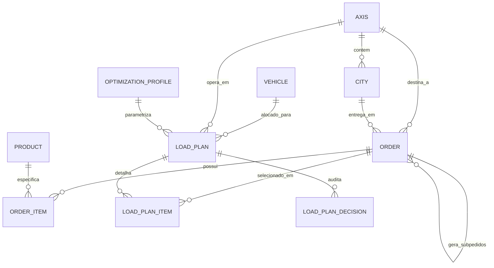

# 07. Modelo de Dados e Schemas Relacionais

---

## 1. Diagrama Entidade-Relacionamento (ERD)



---

## 2. Definição das Entidades do Banco de Dados

### 2.1 Tabela `vehicles`
Armazena a frota de transporte e suas capacidades nominais e operacionais.
```sql
CREATE TABLE vehicles (
    id VARCHAR(36) PRIMARY KEY,
    name VARCHAR(100) NOT NULL,
    plate VARCHAR(20) UNIQUE,
    capacity_kg NUMERIC(10, 2) NOT NULL,
    useful_volume_m3 NUMERIC(10, 4) NOT NULL,
    useful_length_m NUMERIC(6, 2) NOT NULL,
    allows_long_items BOOLEAN NOT NULL DEFAULT FALSE,
    active BOOLEAN NOT NULL DEFAULT TRUE
);
```

### 2.2 Tabela `axes` (Eixos Rodoviários) e `cities`
```sql
CREATE TABLE axes (
    id VARCHAR(36) PRIMARY KEY,
    name VARCHAR(100) NOT NULL,
    active BOOLEAN NOT NULL DEFAULT TRUE
);

CREATE TABLE cities (
    id VARCHAR(36) PRIMARY KEY,
    name VARCHAR(100) NOT NULL,
    axis_id VARCHAR(36) REFERENCES axes(id),
    delivery_order INT NOT NULL -- Posição de descarga no eixo (1, 2, 3...)
);
```

### 2.3 Tabela `orders` (Pedidos)
```sql
CREATE TABLE orders (
    id VARCHAR(36) PRIMARY KEY,
    external_id VARCHAR(50) NOT NULL, -- Ex: L12609291
    axis_id VARCHAR(36) REFERENCES axes(id),
    city_id VARCHAR(36) REFERENCES cities(id),
    total_value NUMERIC(12, 2) NOT NULL,
    total_weight_kg NUMERIC(10, 3) NOT NULL,
    total_volume_m3 NUMERIC(10, 4) NOT NULL,
    has_long_items BOOLEAN NOT NULL DEFAULT FALSE,
    payment_on_delivery BOOLEAN NOT NULL DEFAULT FALSE, -- Flag PGT ENTREGA == A RECEBER
    is_split BOOLEAN NOT NULL DEFAULT FALSE,            -- Flag de Order Splitting
    parent_order_id VARCHAR(36) REFERENCES orders(id),  -- Pedido original se fatiado
    status VARCHAR(30) NOT NULL,                       -- FATURADO, PENDENTE
    created_at TIMESTAMP WITH TIME ZONE DEFAULT NOW()
);
```

### 2.4 Tabela `load_plans` (Planos de Carga Gerados)
```sql
CREATE TABLE load_plans (
    id VARCHAR(36) PRIMARY KEY,
    execution_hash VARCHAR(64) NOT NULL,
    axis_id VARCHAR(36) REFERENCES axes(id),
    vehicle_id VARCHAR(36) REFERENCES vehicles(id),
    profile_id VARCHAR(36),
    total_orders_selected INT NOT NULL,
    total_weight_kg NUMERIC(10, 3) NOT NULL,
    total_volume_m3 NUMERIC(10, 4) NOT NULL,
    total_value NUMERIC(12, 2) NOT NULL,
    weight_occupancy_pct NUMERIC(5, 2) NOT NULL,
    volume_occupancy_pct NUMERIC(5, 2) NOT NULL,
    limiting_resource VARCHAR(10) NOT NULL, -- "PESO" ou "VOLUME"
    estimated_cubage_pct NUMERIC(5, 2) NOT NULL, -- Indicador de confiança RF-005-A
    status VARCHAR(20) NOT NULL, -- DRAFT, APPROVED, CANCELLED
    created_by VARCHAR(50),
    created_at TIMESTAMP WITH TIME ZONE DEFAULT NOW()
);
```
