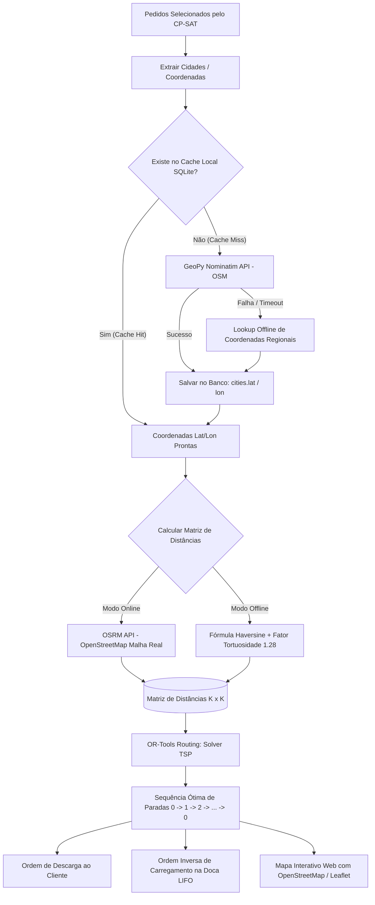

# 13. Módulo de Geocodificação (GeoPy / OpenStreetMap) e Caixeiro Viajante (TSP)

Este documento especifica a arquitetura, formulação matemática e implementação de referência para o **Módulo de Geocodificação Open Source (GeoPy + OpenStreetMap Nominatim)** e o **Módulo de Roteirização do Caixeiro Viajante (TSP - Traveling Salesperson Problem via Google OR-Tools Routing API)**.

---

## 1. Visão Geral da Arquitetura de Roteirização



---

## 2. Geocodificação com GeoPy e OpenStreetMap (Nominatim)

### 2.1 Política de Uso do Nominatim e Boas Práticas
A API pública do Nominatim (OpenStreetMap) possui regras estritas de uso gratuito:
- **Identificação Obrigatória:** Header `User-Agent` customizado e identificável.
- **Rate Limiting:** Máximo de **1 requisição por segundo**.
- **Cache Obrigatório:** Não repetir requisições para o mesmo endereço/cidade.

### 2.2 Dicionário de Coordenadas Oficiais das 24 Cidades/Distritos (Fallback Offline)
Para garantir que o sistema funcione com 100% de disponibilidade mesmo sem internet ou durante instabilidades da API pública:

```python
# app/core/geo_constants.py

DEPOT_COORDINATES = {
    "name": "CD Nobre Lar Crateús (Matriz)",
    "address": "Avenida Doutor Edilberto Frota, 2000, Planalto, Crateús - CE",
    "lat": -5.1784,
    "lon": -40.6775
}

REGION_COORDINATES_CACHE = {
    # Polo Principal
    "CRATEUS":              (-5.1784, -40.6775),
    
    # Eixo 1: Fronteira Piauí
    "BURITI DOS MONTES":     (-5.3117, -41.0967),
    "BARRO VERMELHO":       (-5.2530, -40.9850),
    "TUCUNS":               (-5.2100, -40.8900),
    "QUEIMADAS":            (-5.2800, -41.0200),
    "FILOMENA":             (-5.3400, -41.1200),

    # Eixo 2: Sertão Central
    "SUCESSO":              (-4.9542, -40.4283),
    "TAMBORIL":             (-4.9317, -40.3236),
    "NOVA RUSSAS":          (-4.7061, -40.5636),
    "FAZENDA":              (-4.8500, -40.3800),
    "IBIAPABA":             (-5.0333, -40.9167),

    # Eixo 3: Eixo Sul
    "INDEPENDENCIA":        (-5.3961, -40.3094),
    "SAO JOSE":             (-5.4200, -40.3500),
    "ADAO":                 (-5.4500, -40.4000),
    "VILA GRACA":           (-5.3600, -40.2800),
    "JATOBA DOS UMBELINOS": (-5.4800, -40.4500),
    "SAO GONCALO":          (-5.3000, -40.3200),

    # Eixo 4: Norte e Serra
    "IPAPORANGA":           (-4.9011, -40.7589),
    "PORANGA":              (-4.7472, -40.9161),
    "ARARENDA":             (-4.7419, -40.8256),
    "VACA MORTA":           (-4.8200, -40.8500),
    "CURRAL VELHO":         (-4.8600, -40.8800),
    "CURRAL DO MEIO":       (-4.8800, -40.8900),
    "ROSARIO":              (-4.7800, -40.9400),
    "PAU DE OLEIO":         (-4.8500, -40.7900),

    # Eixo 5: Inhamuns
    "NOVO ORIENTE":         (-5.5347, -40.7742),
    "REALEJO":              (-5.3500, -40.8167),
    "SANTANA":              (-5.5800, -40.7200),
    "MONTE NEBO":           (-5.1472, -40.8389),
    "SANTO ANDRE":          (-5.6200, -40.7500),
    "QUITERIANOPOLIS":      (-5.8119, -40.7028),
    "BARRA DOS SIMIOES":    (-5.6700, -40.7100),
    "LAGOA DAS PEDRAS":     (-5.4100, -40.7400),
    "UMBURANA":             (-5.4600, -40.7600),
    "SITIO GIRA SOL":       (-5.5100, -40.7800)
}
```

---

## 3. Implementação do Geocodificador com Cache

```python
# app/services/geocoder_service.py
import time
from geopy.geocoders import Nominatim
from geopy.extra.rate_limiter import RateLimiter
from app.core.geo_constants import REGION_COORDINATES_CACHE, DEPOT_COORDINATES

class OpenStreetMapGeocoder:
    def __init__(self, user_agent="nobrelog_ia_ufc_crateus"):
        self.geolocator = Nominatim(user_agent=user_agent, timeout=5)
        self.geocode = RateLimiter(self.geolocator.geocode, min_delay_seconds=1.1)

    def get_coordinates(self, city_name: str, db_session=None) -> tuple[float, float]:
        clean_name = city_name.strip().upper()
        
        # 1. Consulta ao cache estático regional imediato
        if clean_name in REGION_COORDINATES_CACHE:
            return REGION_COORDINATES_CACHE[clean_name]

        # 2. Consulta à API Nominatim OpenStreetMap
        try:
            query = f"{city_name}, Ceará, Brasil"
            location = self.geocode(query)
            if location:
                return (location.latitude, location.longitude)
        except Exception as e:
            print(f"[GEOCODER WARNING] Falha na busca OSM para '{city_name}': {e}")

        # 3. Fallback padrão no CD de Crateús
        return (DEPOT_COORDINATES["lat"], DEPOT_COORDINATES["lon"])
```

---

## 4. Cálculo da Matriz de Distâncias

### 4.1 Modo Offline: Distância Haversine com Fator de Estrada
$$\Delta \sigma = 2 rcsin \left( \sqrt{\sin^2\left(rac{\Delta \phi}{2}
ight) + \cos(\phi_1)\cos(\phi_2)\sin^2\left(rac{\Delta \lambda}{2}
ight)} 
ight)$$
$$d_{	ext{km}} = R \cdot \Delta \sigma 	imes 1,28 \quad (R = 6.371	ext{ km})$$

```python
# app/services/distance_matrix.py
import math

def haversine_road_distance_km(coord1: tuple, coord2: tuple, road_factor: float = 1.28) -> float:
    lat1, lon1 = coord1
    lat2, lon2 = coord2
    
    R = 6371.0 # Raio da Terra em km
    phi1, phi2 = math.radians(lat1), math.radians(lat2)
    dphi = math.radians(lat2 - lat1)
    dlambda = math.radians(lon2 - lon1)

    a = math.sin(dphi / 2)**2 + math.cos(phi1) * math.cos(phi2) * math.sin(dlambda / 2)**2
    c = 2 * math.atan2(math.sqrt(a), math.sqrt(1 - a))
    
    geodesic_dist = R * c
    return round(geodesic_dist * road_factor, 2)

def build_distance_matrix(locations: list[tuple[float, float]]) -> list[list[int]]:
    """Gera matriz K x K em metros inteiros para o OR-Tools Routing."""
    n = len(locations)
    matrix = [[0] * n for _ in range(n)]
    for i in range(n):
        for j in range(n):
            if i != j:
                dist_km = haversine_road_distance_km(locations[i], locations[j])
                matrix[i][j] = int(dist_km * 1000) # metros
    return matrix
```

---

## 5. Solucionador do Caixeiro Viajante (TSP) com OR-Tools Routing

```python
# app/services/tsp_solver.py
from ortools.constraint_solver import routing_enums_pb2, pywrapcp

def solve_tsp(
    distance_matrix: list[list[int]],
    depot_index: int = 0,
    roundtrip: bool = True,
    time_limit_sec: int = 5
) -> dict:
    """
    Resolve o Caixeiro Viajante (TSP) a partir do depósito em Crateús.
    - distance_matrix: Matriz K x K em metros.
    - depot_index: Índice 0 = CD Nobre Lar Crateús.
    - roundtrip: True = Caminhão retorna ao CD; False = Encerra na última entrega.
    """
    num_nodes = len(distance_matrix)
    if num_nodes <= 1:
        return {"route": [0], "total_distance_km": 0.0}

    manager = pywrapcp.RoutingIndexManager(num_nodes, 1, depot_index)
    routing = pywrapcp.RoutingModel(manager)

    def distance_callback(from_index, to_index):
        from_node = manager.IndexToNode(from_index)
        to_node = manager.IndexToNode(to_index)
        return distance_matrix[from_node][to_node]

    transit_callback_index = routing.RegisterTransitCallback(distance_callback)
    routing.SetArcCostEvaluatorOfAllVehicles(transit_callback_index)

    # Parâmetros de Busca do OR-Tools Routing
    search_parameters = pywrapcp.DefaultRoutingSearchParameters()
    search_parameters.first_solution_strategy = (
        routing_enums_pb2.FirstSolutionStrategy.PATH_CHEAPEST_ARC
    )
    search_parameters.local_search_metaheuristic = (
        routing_enums_pb2.LocalSearchMetaheuristic.GUIDED_LOCAL_SEARCH
    )
    search_parameters.time_limit.seconds = time_limit_sec

    solution = routing.SolveWithParameters(search_parameters)

    if not solution:
        # Fallback trivial se não encontrar solução ótima no tempo
        return {"route": list(range(num_nodes)), "total_distance_km": 0.0}

    index = routing.Start(0)
    route = []
    total_distance_meters = 0

    while not routing.IsEnd(index):
        node = manager.IndexToNode(index)
        route.append(node)
        previous_index = index
        index = solution.Value(routing.NextVar(index))
        total_distance_meters += routing.GetArcCostForVehicle(previous_index, index, 0)

    if roundtrip:
        route.append(manager.IndexToNode(index)) # Retorno ao CD

    return {
        "route": route,
        "total_distance_km": round(total_distance_meters / 1000.0, 2)
    }
```

---

## 6. Lógica de Sequenciamento LIFO (Carregamento na Doca)

A partir da rota calculada pelo TSP:
$$	ext{Rota de Descarga (Cliente): } 	ext{CD} 	o 	ext{Stop 1} 	o 	ext{Stop 2} 	o 	ext{Stop 3}$$
$$	ext{Ordem de Carregamento (Doca): } 	ext{Stop 3 (Fundo da Caçamba)} 	o 	ext{Stop 2 (Meio)} 	o 	ext{Stop 1 (Porta da Caçamba)}$$

Isso assegura que o motorista nunca precise movimentar ou descarregar mercadorias de outros clientes para alcançar os pedidos da parada atual.
